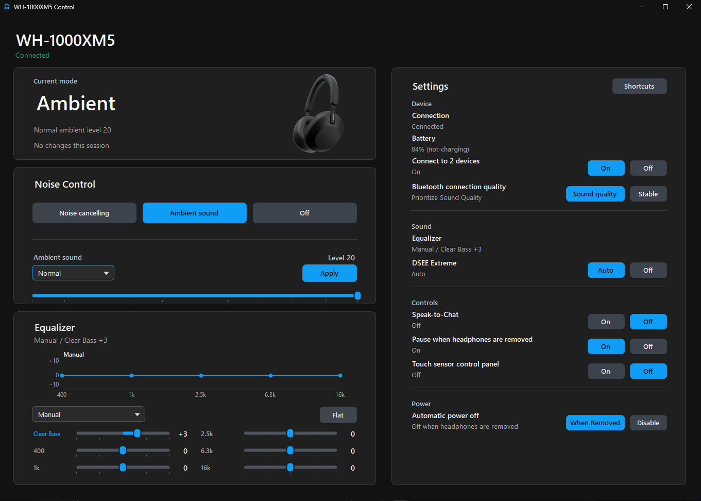

# Sony XM Control

Unofficial Windows controller for Sony 1000X headphones and earbuds.



## Supported Devices

- WH-1000XM5
- WF-1000XM5
- WH-1000XM6
- WF-1000XM6

## Features

- Automatic device detection
- Noise cancelling, ambient sound, and off modes
- Ambient sound level control
- Equalizer presets and live EQ band control
- Clear Bass control
- DSEE Extreme Auto/Off
- Bluetooth connection quality mode
- Multipoint toggle
- Speak-to-Chat toggle
- Wearing sensor pause toggle
- Touch sensor panel toggle
- Automatic power off setting
- Tray quick actions
- Configurable global keyboard shortcuts

## Download

Download the latest release zip from the Releases page, extract it, and run:

```text
ui\xm5ui.exe
```

Pair and connect the headphones in Windows Bluetooth settings first.

## Build

Requirements:

- Windows 10 or Windows 11
- Visual Studio C++ Build Tools for the native Bluetooth backend
- .NET Framework 4.x compiler, or Visual Studio Build Tools with C# support

Build everything and create a release zip:

```powershell
powershell.exe -ExecutionPolicy Bypass -File .\build-release.ps1 -Version v1.0
```

Build manually:

```bat
cd src\c
build.bat

cd ..\ui
build-ui.bat
```

The UI expects the backend at `..\c\xm5ctl.exe`, so keep the `c` and `ui` folders together.

## Notes

This project is not affiliated with Sony.

Bluetooth control depends on Windows being able to open the headset's RFCOMM service. If commands fail, make sure the device is paired, connected, and selected as an audio device in Windows.
